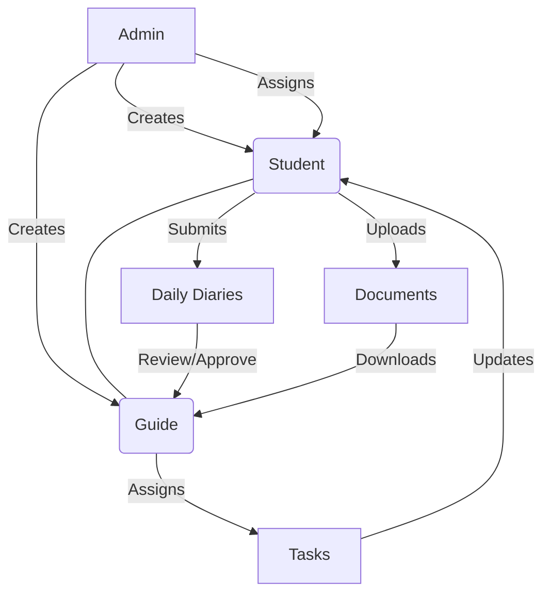

# 🎓 Internship Management System (IMS) - Project Compendium

Welcome to the **Internship Management System**! This document is designed to give you a complete, top-to-bottom understanding of how the system works—whether you are a developer, a student, or a project manager.

---

## 🌟 1. Introduction: The "Big Picture"
Imagine a student doing an internship at a tech company. They need to report what they do every day, their supervisor needs to check that work, and the university needs to keep records of everything. 

The **Internship Management System (IMS)** is the digital bridge that connects these people. It replaces messy paper logs and scattered emails with a single, professional portal where progress is tracked, feedback is given, and documents are stored securely.

---

## 👥 2. Who is it for? (System Roles)

There are three main types of people who use this system:

1.  **👑 The Admin (The Architect)**
    *   **Goal**: Keep the system running and organized.
    *   **What they do**: Create accounts for everyone, link students to their specific guides (mentors), and keep an eye on the overall system health.
2.  **🎓 The Guide (The Mentor)**
    *   **Goal**: Supervise and support the intern.
    *   **What they do**: Read student diaries, check their code/reports, assign specific tasks, and provide feedback on whether the student is doing well.
3.  **📝 The Student (The Intern)**
    *   **Goal**: Learn and report progress.
    *   **What they do**: Fill out daily diaries, update their status on assigned tasks, and upload their final project reports for review.

---

## 🏗️ 3. How it's Built (The Technical "Engine")

For those curious about the "under the hood" details, we use modern technology to keep the system fast and secure.

### The Anatomy of the App
-   **🧠 The Brain (ASP.NET Core 8)**: This is the main engine that processes logic, handles security, and decides what data goes where.
-   **💾 The Memory (SQL Server)**: This is where all the information (user profiles, diaries, tasks) is stored permanently.
-   **🎨 The Face (Razor Views & Bootstrap 5)**: This is what you see on your screen. We use Bootstrap to make sure it looks great on both laptops and phones.
-   **🔗 The Connector (Entity Framework Core)**: A special tool that lets the "Brain" talk to the "Memory" easily.

### Visual Workflow

---

## ⚙️ 4. Key Implementation Features

We didn't just build a basic website; we built an **industry-ready** application with some specialized features:

### 🚀 Independent Tab Sessions (Multi-Session Support)
Have you ever tried to log into two different accounts in two tabs and it got confused? Our system uses a unique **Session ID (sid)** in the URL (e.g., `/s5a2b1/Account/Login`). This allows you to work in multiple tabs independently without one tab overwriting the other.

### 🛡️ Ironclad Security
-   **Role-Based Access**: A student cannot see what other students are doing. A guide cannot see students who aren't assigned to them.
-   **Validation**: The system checks for duplicate emails or enrollment numbers immediately to prevent "messy data."
-   **Anti-Forgery**: We use special tokens on every form to prevent hackers from submitting data on your behalf.

### ⚡ Smooth Experience (AJAX & SweetAlert2)
Instead of the whole page refreshing every time you click "Save," we use background updates. You'll see beautiful pop-up messages (SweetAlert2) confirming your actions, making it feel more like a mobile app than a clunky old website.

---

## 🔄 5. Core System Workflows

### The Life of a Diary Entry
1.  **Submission**: A Student fills out their work for Tuesday.
2.  **Notification**: The Guide sees a "Pending" entry on their dashboard.
3.  **Review**: The Guide reads the entry. If it's good, they click **Approve**. If it needs more detail, they click **Reject** and add a comment.
4.  **Completion**: The Student sees the update and moves on to Wednesday.

### Task Management
1.  **Assignment**: The Guide realizes the student needs to learn "SQL Basics" and creates a task.
2.  **In-Progress**: The Student sees the task and marks it as "In Progress."
3.  **Finished**: Once done, the Student marks it as "Completed."

---

## 🚀 6. The Roadmap (Future Enhancements)

The system is already powerful, but we have big plans for the future:

*   **🤖 AI Feedback Assistant**: Using AI to automatically scan diary entries and flag students who might be struggling or stuck.
*   **🔔 Real-Time "Pings"**: Using SignalR to send instant notifications (toast messages) the moment a guide approves a diary.
*   **📱 Mobile App Migration**: Moving the frontend to **React** to create a native mobile experience for students on the go.
*   **📊 Insight Dashboards**: Interactive charts for Admins to see which departments are the most active and which students are ahead of schedule.

---

## 📖 7. Glossary (Tech Terms for Humans)

*   **MVC (Model-View-Controller)**: A way of organizing code into "Data", "Design", and "Logic".
*   **CRUD**: Create, Read, Update, Delete (The four basic things you can do with data).
*   **D.I. (Dependency Injection)**: A smart way of providing tools to different parts of the code so they don't become messy.
*   **sid (Session ID)**: The short code in the URL that keeps your tab session unique.

---

> [!TIP]
> **Getting Started**
> If you are a developer looking to run this project locally, ensure you have the **.NET 8 SDK** and **SQL Server** installed. Update your connection string in `appsettings.json`, run `dotnet ef database update`, and you're ready to go!
